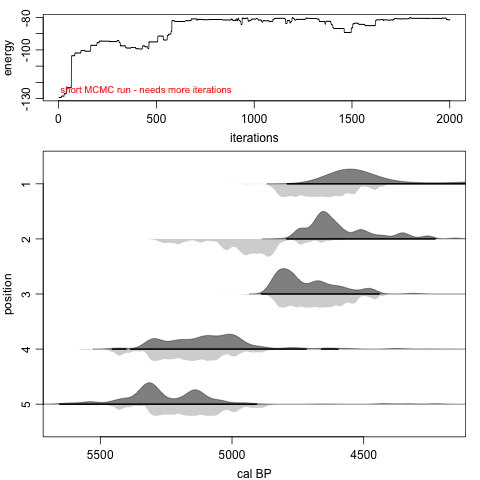
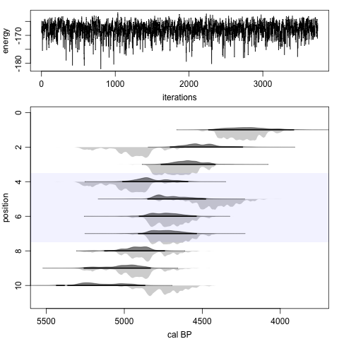
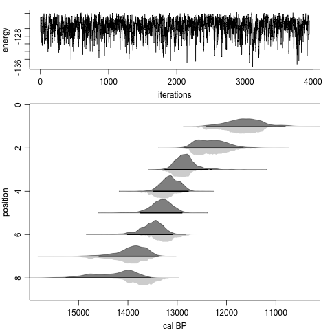

Chronological Ordering For Fossils and Environmental Events can be acronymised to *coffee*. While individual calibrated radiocarbon dates can span several centuries, combining multiple dates together with any chronological constraints can make a chronology much more robust and precise.

This package uses Bayesian methods to enforce the chronological ordering of radiocarbon and other dates, for example for trees with multiple radiocarbon dates spaced at exactly known intervals (e.g., 10 annual rings). Another example is sites where the relative chronological position of the dates is taken into account - the ages of dates further down a site or core must be older than those of dates further up. For further details, see Blaauw et al. 2024[^1].

On first usage of the package, it has to be installed: 

```{r, eval=FALSE}
install.packages('coffee')
``` 

To load the code:

```{r}
library(coffee)
```
***

## 1. tree rings

Let's simulate the radiocarbon dating of a tree with 400 rings, which started growing in AD 950 (1000 cal BP), with rings radiocarbon dated at regularly spaced 20-yr intervals, and then wiggle-match it using a Bayesian framework (Christen and Litton 1995[^2]):

```{r, fig.width=4, fig.asp=1.3}
sim.rings(age.start=1000, length=400, gaps=20)
mytree <- rings()
```

The above plot (Fig. 1) contains two panels: the top one shows the calibrated (blue) and wiggle-matched (grey) distributions of all radiocarbon dates, and the bottom one shows how the uncalibrated radiocarbon dates (steelblue dots with error bars) match the calibration curve (green), as well as the modelled age distribution of the ring of interest (by default the oldest, innermost one). 

The variable mytree contains both the radiocarbon dating information and the estimated age distribution of the oldest ring.  

The file containing the dates should have the following formatting (only the first five entries are shown): 

| lab ID | age  | error | ring | cc  |
| ------ | ---- | ----- | ---- | --  |
| 18881  | 601  | 18    | 400  |  1  |
| 18882  | 583  | 17    | 380  |  1  |
| 18883  | 606  | 19    | 360  |  1  |
| 18884  | 709  | 21    | 340  |  1  |
| 18885  | 733  | 23    | 320  |  1  |

The fourth column should contain the ring number, starting with the youngest, outermost ring and working down backwards in time toward the date of the oldest, innermost ring. The above dates are calibrated using IntCal20 (Reimer et al. 2020[^3]) through supplying cc=1; Marine20 (Heaton et al. 2020[^4], cc=2), SHCal20 (Hogg et al. 2020[^5], cc=3) or a tailor-made calibration curve (cc=4) can also be used. Dates that are already on the cal BP scale get cc=0. As with rbacon's .csv files[^6], additional columns can be added to deal with reservoir offsets (mean and error; columns 6 and 7) and to provide parameters for the student-t distribution (t.a and t.b; columns 8 and 9).

For more information, ask for help:

```{r, eval=FALSE}
?rings
```

The above example requires the estimate of one parameter only, i.e. the calendar age of the initial ring, and this can be calculated analytically without the need for computing-intensive MCMC iterations. But what if we had some uncertainty regarding a possible age offset of (all) radiocarbon dates of a sequence? Then we'd have to estimate two parameters; the initial age and the reservoir offset. We thus need resort to MCMC to do this, using the following function:

```{r, eval=FALSE}
MCMCrings(its=5e4) # note that this run will take around half a minute
```

```{r}
# The run's files will be put in this folder: trees/Ulandryk
#   |>>>>>>>>>>>>>>>>>>>>>>>>>>>>>>>>>>>>>>>>>>>>>>>>>>>>>>>>>>>>>>>>>>>>>>| 100%
# Done running...
# Removed a burn-in of 1000
# Thinning the MCMC by storing every 55 iterations
# Age estimate: 2629.2 - 2619.2 cal BP (93.4%)
# deltaR: -2.5 - 19.5 (94.7%)
```


## 2. stratigraphy

Now that the coffee is brewing, let's imagine a tiramisu or spekkoek[^7]. A site's stratigraphy can be age-modelled by assuming chronological ordering of the layers and dates according to their relative position, with levels further down a site assumed to be older than those above them. This can too be done within a Bayesian framework (e.g., Buck et al. 1991[^8]):

```{r, eval=FALSE}
set.seed(123)
sim.strat()
strat(its=2e5) # note that this run will take a few minutes
```

```{r}
# The run's files will be put in this folder: strats/mystrat
#   |>>>>>>>>>>>>>>>>>>>>>>>>>>>>>>>>>>>>>>>>>>>>>>>>>>>>>>>>>>>>>>>>>>>>>>| 100%
# Done running...
# Removed a burn-in of 100
# Thinning the MCMC by storing every 8 iterations
# 79.71% of the model's ages fit within the 95% hpd ranges of the dates,
# with worst-fitting date 2 (51.38%) and best-fitting date 4 (93.89%)
# Run took 3.17 minutes
```


Beside the graph itself, the model also reports how well the modelled ages fit within the highest posterior density (hpd) ranges of the dates (if all modelled age iterations fit in any of a date's hpd ranges, its fit is 100%, and if, say, only half of the iterations fall inside of the hpd ranges, its fit it 50%). The model's running time is also reported (we hope to be able to speed up the strats runs in the future).

Strat files are .csv files formatted like so:

| lab ID | age  | error | position | cc |
| ------ | ---- | ----- | -------- | -- |
| 8881   | 4147 | 83    | 1        | 1  |
| 8882   | 4326 | 87    | 2        | 1  |
| 8883   | 4159 | 83    | 3        | 1  |
| 8884   | 4530 | 91    | 4        | 1  |
| 8885   | 4521 | 90    | 5        | 1  |

The positions of the dates are indicated in the fourth column. See below for more options such as gaps, undated levels or blocks of dates in a layer.

Note that the above model uses 200,000 iterations and took around 3 minutes to run on a reasonably fast computer (it is hoped future versions of 'coffee' will be able to run faster). It is recommendable to assess the influence of the MCMC settings on the model, and use sufficiently large sample sizes (at least 3,000 remaining iterations are recommended, but the actual number will depend on the number of dates). Note that the thinning size is calculated from the MCMC run by default. In the following command, on purpose we are providing some bad initial point age estimates (but still in chronological order; 2 rows of initial ages are needed), storing every single iteration (both thinning and internal.thinning are set to 1), not removing the burn-in and performing a much-too-short run of only 2000 iterations:

```{r, eval=FALSE, fig.width=4, fig.asp=1.3}
set.seed(234)
sim.strat()
strat(burnin=0, thinning=1, internal.thinning=1, its=2000, 
  init.ages=rbind(seq(3000, 4000, length=5), rbind(seq(3010, 4010, length=5))))
```



As can be seen from the top panel, the burnin of the above example took around 500 to 1000 iterations, and also clearly visible are long horizontal stretches that indicate parts of the MCMC where none of the proposed iterations could be accepted. Hence the need for thinning and much longer runs. 

### 2.1 stratigraphical features

#### 2.1.1 blocks

Sometimes, layers might contain material which cannot be assumed to be in chronological order within that layer (a bit like apple pie), even though the layer itself can safely be assumed to be older than the layers above it and younger than the layers below. In this case, we can assign this 'block' of dates to the same position (in this example, layer 4 contains four unordered dates, and we're using SHCal20):

| lab ID | age  | error | position | cc |
| ------ | ---- | ----- | -------- | -- |
| 8881   | 3837 | 77    | 1        | 3  |
| 8882   | 4327 | 87    | 2        | 3  |
| 8883   | 4138 | 83    | 3        | 3  |
| 8884   | 4357 | 87    | 4        | 3  |
| 8885   | 3968 | 79    | 4        | 3  |
| 8886   | 4200 | 84    | 4        | 3  |
| 8887   | 4186 | 84    | 4        | 3  |
| 8888   | 4294 | 86    | 5        | 3  |
| 8889   | 4325 | 86    | 6        | 3  |
| 8890   | 4240 | 85    | 7        | 3  |

Such sites can be modelled too (the blue shading indicates the dates within the block):

```{r, eval=FALSE, fig.width=4, fig.asp=1.3}
strat("block_example", its=2e6, thinning=20, internal.thinning=20) # takes long to run
```



#### 2.1.2 undated levels

If you're interested in modelling the ages of undated levels, in-between dated levels, this can be done in two ways. The first option is to add an undated level, by adding an entry to your .csv file and providing the number 10 in the fifth (=cc) column, for example:

| lab ID  | age   | error | position | cc |
| ------  | ----- | ----- | -------- | -- |
| 12263   | 10091 | 202   | 1        | 1  |
| 12549   | 10505 | 210   | 2        | 1  |
| 12760   | 10986 | 220   | 3        | 1  |
| 12918   | 11410 | 228   | 4        | 1  |
| undated |       |       | 5        | 10 |
| 13326   | 11363 | 227   | 6        | 1  |
| 13594   | 12042 | 241   | 7        | 1  |
| 13759   | 11824 | 236   | 8        | 1  |

Any name can be given for the lab ID, and the age and error should be left empty. Make sure that the position of the undated level is such that the positions are increasing going down the file. Then run as:

```{r, eval=FALSE}
strat("undated_example") # will need a longer run for reliable results (the example below used 600,000 iterations)
```
```
# The run's files will be put in this folder: strats/undated_example
#   |>>>>>>>>>>>>>>>>>>>>>>>>>>>>>>>>>>>>>>>>>>>>>>>>>>>>>>>>>>>>>>>>>>>>>>| 100%
# Done running...
# Removed a burn-in of 100
# Thinning the MCMC by storing every 19 iterations
# 83.54% of the model's ages fit within the 95% hpd ranges of the dates, with worst-fitting date 8 (55.44%) and best-fitting date 7 (96.42%)
# Run took 8.15 minutes
```



Alternatively, just run your site as usual, and after the run model the ages between two of the dated levels (Fig. 6 below; for each iteration this will model random years that fit between the ages of the dates below and above it):

```{r, fig.width=4, fig.asp=1.3}
set.seed(123)
sim.strat(n=5)
strat(its=1000, burnin=0, thinning=1, internal.thinning=1, show.progress=FALSE) # much too short
layout(1) # new plot
if(length(info$output) > 0) { # to avoid runs that produced no remaining iterations
  undated_1.5 <- ages.undated(1.5) # ages between positions 1 and 2
  summary(undated_1.5)
}
```
  
#### 2.1.3 gaps  

In some instances, there could be information about the time gaps between dated levels. These gaps could either be known exactly (e.g., tree rings), or with a degree of uncertainty (e.g., varves with counting uncertainty, or the development of soils which could be assumed to take an approximately-known amount of time). Coffee can model such gaps as follows:

| lab ID    | age   | error | position | cc |
| --------- | ---   | ----- | -------- | -- |
| 12263     | 10091 | 202   | 1        | 1  |
| exactgap  | 200   |       | 1.5      | 11 |
| 12549     | 10505 | 210   | 2        | 1  |
| 12760     | 10986 | 220   | 3        | 1  |
| normalgap | 100   | 20    | 3.5      | 12 |
| 12918     | 11410 | 228   | 4        | 1  |
| 13326     | 11363 | 227   | 5        | 1  |
| gammagap  | 100   | 2     | 5.5      | 13 |
| 13594     | 12042 | 241   | 6        | 1  |
| 13759     | 11824 | 236   | 7        | 1  | 

Here, an exact gap is indicated with cc=11, and the size of the gap is placed in the age field (no error to be added). For a normally distributed gap size, add cc=12, and the mean and standard error go in the age and error fields respectively. For a gamma distributed gap size, add cc=13, and enter the mean and shape in the age and error fields respectively.

```{r, eval=FALSE}
strat("gaps_example") # will need a longer run for reliable results (the example below used 1 million iterations, followed by thinning using the thinner() function)
```
```
# The run's files will be put in this folder: strats/gaps_example
#   |>>>>>>>>>>>>>>>>>>>>>>>>>>>>>>>>>>>>>>>>>>>>>>>>>>>>>>>>>>>>>>>>>>>>>>| 100%
# Done running...
# Removed a burn-in of 100
# Thinning the MCMC by storing every 7 iterations
# 86.3% of the model's ages fit within the 95% hpd ranges of the dates, with worst-fitting date 7 (72.34%) and best-fitting date 3 (96.38%)
# Run took 14.52 minutes
```
![Fig. 7 - output of a strat simulation containing gaps between dated levels; an exact gap between positions 1 and 2 (Ex(200)), a normally distributed one between positions 3 and 4 (N(100,20)), and a gamma distributed one between positions 5 and 6 (Ga(100,2)). Blue diagonal lines indicate the size and nature of the gaps. Note that the modelled (dark grey) distributions of dates 1 and 2 are the exact same shape, but shifted by exactly 200 years. The shapes of the modelled distributions surrounding the normal and gamma gaps show only some similarity. ](./strat_gaps.png){width=70%}

For more help, type `?strat`.

[^1]: Blaauw M, Aquino-Lopez MA, Christen JA, in press. Modelling chronologically ordered radiocarbon dates in R. *Radiocarbon* <http://dx.doi.org/10.1017/RDC.2024.56>

[^2]: Christen JA, Litton CD, 1995. A Bayesian approach to wiggle-matching. *Journal of Archaeological Science* 22, 719-725

[^3]: Reimer PJ et al. 2020. The IntCal20 Northern Hemisphere radiocarbon age calibration curve (0-55 cal kBP). *Radiocarbon* 62, 725-757

[^4]: Heaton et al. 2020. Marine20-the marine radiocarbon age calibration curve (0-55,000 cal BP). *Radiocarbon* 62, 779-820

[^5]: Hogg et al. 2020. SHCal20 Southern Hemisphere calibration, 0-55,000 years cal BP. *Radiocarbon* 62, 759-778

[^6]: please check the vignette at https://cran.r-project.org/package=rbacon

[^7]: https://en.wikipedia.org/wiki/Spekkoek

[^8]: Buck CE, Kenworthy JB, Litton CD, Smith AFM, 1991. Combining archaeological and radiocarbon information: a Bayesian approach to calibration. *Antiquity* 65, 808-821.
