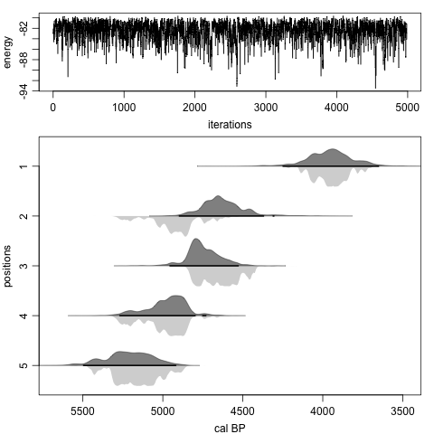

Chronological Ordering for Fossils and Environmental Events can be acronymised to *coffee*. While individual calibrated radiocarbon dates can span several centuries, combining multiple dates together with any chronological constraints can make a chronology much more robust and precise.

This package uses Bayesian methods to enforce the chronological ordering of radiocarbon and other dates, for example for trees with multiple radiocarbon dates spaced at exactly known intervals (e.g., 10 annual rings). Another example is sites where the relative chronological position of the dates is taken into account - the ages of dates further down a site must be older than those of dates further up.

On first usage of the package, it has to be installed: 

```{r, eval=FALSE}
install.packages('coffee')
``` 

To load the code:

```{r}
library(coffee)
```

Now you can simulate the radiocarbon dating of a tree with 400 rings, which was felled in AD 1750 (200 cal BP), with dates at regularly spaced 20-yr intervals, and then wiggle-match it using a Bayesian framework (Christen and Litton 1995[^1]):

```{r, fig.width=4, fig.asp=1.3}
sim.rings(age.min=200, length=400, gaps=20)
rings()
```

The plot contains two panels: the top one shows the calibrated (blue) and wiggle-matched (grey) distributions of all radiocarbon dates, and the bottom one shows how the uncalibrated radiocarbon dates (steelblue dots with error bars) match the calibration curve (green), as well as the modelled age distribution of the ring of interest (by default the youngest one, ring 0).

For more information, ask for help:

```{r, eval=FALSE}
?rings
```

You can also model a stratigraphy, assuming chronological ordering of the dates according to their relative position (also within a Bayesian framework; Buck et al. 1991):

```{r, eval=FALSE}
sim.strat()
strat(its=1e6, burnin=100)
```



Note that the above model uses a million iterations and took around 7 minutes to run on a reasonably fast computer. It is recommendable to assess the influence of the MCMC settings on the model, and use sufficiently large sample sizes. Note that the thinning size is calculated from the MCMC run by default. In the following command, on purpose we are providing some bad initial point age estimates (but still in chronological order), store every iteration, do not remove the burn-in and do a much-too-short run of only 2000 iterations:

```{r, eval=FALSE, fig.width=4, fig.asp=1.3}
sim.strat()
strat(burnin=0, thinning=1, its=2000, init.ages=seq(3000, 4000, length=5))
````


The burnin in the above example took around 500 to 1500 iterations, and also clearly visible are long horizontal stretches that indicate parts of the MCMC where no iterations could be accepted. Hence the need for thinning and much longer runs. Note that a warning is given that the run has to be made longer.

***

The plan is to add more types of models in the future, for example ones where the gaps between dates come with uncertainties.


[^1]: Christen JA, Litton CD, 1995. A Bayesian approach to wiggle-matching. *Journal of Archaeological Science* 22, 719-725

[^2]: Buck CE, Kenworthy JB, Litton CD, Smith AFM, 1991. Combining archaeological and radiocarbon information: a Bayesian approach to calibration. *Antiquity* 65, 808-821.
